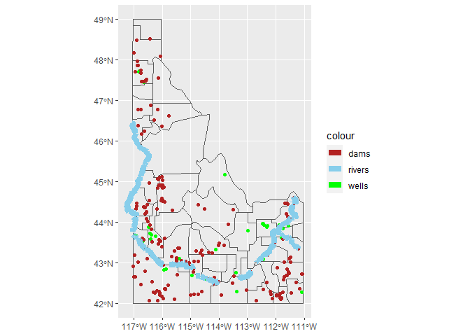

# Idaho_Map
2024-03-23

``` r
#Load Libraries

#Library for mapping
library(sf)
```

    Warning: package 'sf' was built under R version 4.3.3

    Linking to GEOS 3.11.2, GDAL 3.8.2, PROJ 9.3.1; sf_use_s2() is TRUE

``` r
#Library for typical functions
library(tidyverse)
```

    ── Attaching core tidyverse packages ──────────────────────── tidyverse 2.0.0 ──
    ✔ dplyr     1.1.4     ✔ readr     2.1.5
    ✔ forcats   1.0.0     ✔ stringr   1.5.1
    ✔ ggplot2   3.4.4     ✔ tibble    3.2.1
    ✔ lubridate 1.9.3     ✔ tidyr     1.3.0
    ✔ purrr     1.0.2     

    ── Conflicts ────────────────────────────────────────── tidyverse_conflicts() ──
    ✖ dplyr::filter() masks stats::filter()
    ✖ dplyr::lag()    masks stats::lag()
    ℹ Use the conflicted package (<http://conflicted.r-lib.org/>) to force all conflicts to become errors

``` r
# Wells zip
pacman::p_load(downloader, sf, fs, tidyverse)
wells_path <- "https://byuistats.github.io/M335/data/Wells.zip"

df <- tempfile(); uf <- tempfile()
download(wells_path, df, mode = "wb")

unzip(df, exdir = uf)
wells <- read_sf(uf)
file_delete(df); dir_delete(uf)

# Dams zip
dams_path <- "https://byuistats.github.io/M335/data/Idaho_Dams.zip"

df <- tempfile(); uf <- tempfile()
download(dams_path, df, mode = "wb")

unzip(df, exdir = uf)
dams <- read_sf(uf)
file_delete(df); dir_delete(uf)

# Water zip
wells_path <- "https://byuistats.github.io/M335/data/water.zip"

df <- tempfile(); uf <- tempfile()
download(wells_path, df, mode = "wb")

unzip(df, exdir = uf)
water <- read_sf(uf)
file_delete(df); dir_delete(uf)

# State Shape zip
state_shape_path <- "https://byuistats.github.io/M335/data/shp.zip"

df <- tempfile(); uf <- tempfile()
download(state_shape_path, df, mode = "wb")

unzip(df, exdir = uf)
state_shape <- read_sf(uf)
file_delete(df); dir_delete(uf)
```

``` r
#Filter the wells column to clean up the data.

wells2 <- wells |> 
   filter(Production >= 5000)

#Filter the dams column to clean up the data.

dams2 <- dams |> 
   filter(SurfaceAre >= 50)

#Filter the water/ river column to clean up the data.

water2 <- water |> 
   filter(FEAT_NAME %in% c("Snake River", "Henrys Fork"))


#Filter the state column to only get Idaho and make it straight.

state_shape2 <- state_shape |> 
  filter(StateName == "Idaho")
```

``` r
# Display Map

ggplot(data = state_shape2) +
  geom_sf(fill = NA) +
  geom_sf(data = wells2, aes(color = "wells"))+
  geom_sf(data = dams2, aes(color = "dams"))+
  geom_sf(data = water2, aes(color = "rivers"), lwd = 3)+
  coord_sf(crs = st_crs(4267))+
  scale_color_manual(values = c("firebrick", "skyblue", "green"))
```



``` r
#Save the image and adjust size when user opens it.

ggsave("Idaho_Water.png", width = 15, height = 10)
```
