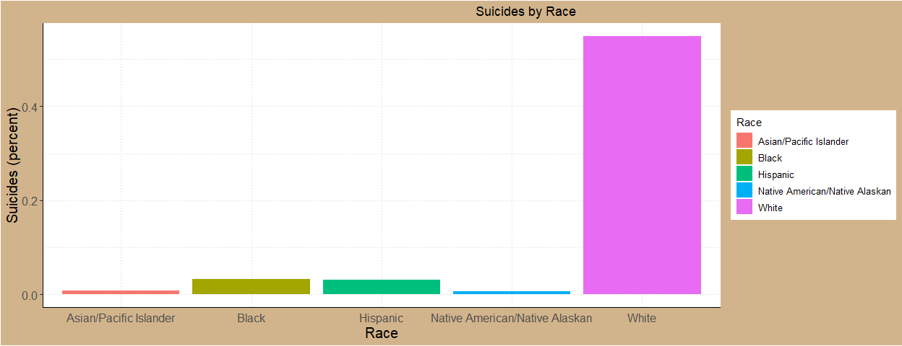

# Gun_Deaths
2024-02-07

``` r
library(tidyverse)
```

    ── Attaching core tidyverse packages ──────────────────────── tidyverse 2.0.0 ──
    ✔ dplyr     1.1.4     ✔ readr     2.1.5
    ✔ forcats   1.0.0     ✔ stringr   1.5.1
    ✔ ggplot2   3.4.4     ✔ tibble    3.2.1
    ✔ lubridate 1.9.3     ✔ tidyr     1.3.0
    ✔ purrr     1.0.2     
    ── Conflicts ────────────────────────────────────────── tidyverse_conflicts() ──
    ✖ dplyr::filter() masks stats::filter()
    ✖ dplyr::lag()    masks stats::lag()
    ℹ Use the conflicted package (<http://conflicted.r-lib.org/>) to force all conflicts to become errors

``` r
Gundeaths <- read.csv("https://github.com/fivethirtyeight/guns-data/raw/master/full_data.csv")
```

## Question 1:

Which race has the most suicides and by how much?

``` r
Gundeaths2 <- Gundeaths %>% 
  mutate(
    gungroup = case_when(
      intent == "Suicude" & age >= 45 & sex == "M" ~ "Older Male Suicide",
      intent == "Homicide" & age <= 30 & race == "Black" & sex == "M" ~ "Young Black Male Homicide",
        TRUE ~ "Other Gun Death"),
    season = case_when(
      month %in% c(12, 1, 2) ~ "Winter",
      month %in% c(3, 4, 5) ~ "Spring",
      month %in% c(6, 7, 8) ~ "Summer",
      month %in% c(9, 10, 11) ~ "Fall"
    )
  ) %>% 
  mutate(monthabb = month.abb[as.numeric(month)]) %>% 
  mutate(monthabb = factor(monthabb, month.abb))
```

``` r
colnames(Gundeaths2)[which(colnames(Gundeaths2) == "race")] <- "Race"


Suicide <- Gundeaths2 %>% 
  filter(intent == "Suicide") %>% 
  group_by(Race) %>% 
  summarise(Total = n())
```

## First Chart Showing the Various Suicides by race:

``` r
ggplot(data = Suicide, 
       mapping = aes(y = Total, x = Race, fill = Race)) +
  
  geom_col() +
     labs(x= "Race", y = "Suicides", title = "Suicides by Race")+

  labs(title = "Suicides by Race") +
  theme(plot.title = element_text(hjust=.75),
        axis.text = element_text(angle = 0, size = 12),
        axis.ticks.x = element_blank(),
        panel.background = element_rect(fill = "white"),
        panel.grid = element_line(linetype = "dotted", color = "lightgrey"),
        axis.line = element_line(linetype = "solid", color = "black"),
        axis.title = element_text(size = 15), 
        plot.background = element_rect(fill = "tan"),
        legend.key = element_rect(fill = "white"),
        legend.text = element_text(size = 10)
        
  )
```



## Question 1 Answer:

As you can tell, by a significant margin, white people have the highest
suicide rate out of any other race.

## Question 2:

Does education level play a role in gun deaths?

## Question 2 Chart and Answer:

The data below shows all the gun deaths based on education throughout
the 4 seasons. As you can see, those in High School are extraordinarily
higher than any other education. Also, note that those who graduate
college are significantly less likely to be part of a gun death.

``` r
ggplot(data = Gundeaths2,
       mapping = aes(x = education, fill = season)) +
  geom_bar(position = "dodge", color = "black") +
  labs(x = "Education", y = "Count", title = "Gun deaths based on Education") +
  theme_bw()+


  labs(title = "Gun deaths based on Education") +
  theme(plot.title = element_text(hjust=.75),
        axis.text = element_text(angle = 35),
        axis.ticks.x = element_blank(),
        panel.background = element_rect(fill = "white"),
        panel.grid = element_line(linetype = "dotted", color = "lightgrey"),
        axis.line = element_line(linetype = "solid", color = "black"),
        axis.title = element_text(size = 15), 
        plot.background = element_rect(fill = "tan"),
        legend.key = element_rect(fill = "white"),
        legend.text = element_text(size = 10),
        axis.text.x = element_text(hjust = 1)
        
  )
```


\##Question 3:

Does someone’s sex play a factor in gun deaths and by how much?

## Question 3 Chart and Answer:

The data below displays Gun deaths by sex throughout the 4 seasons. Note
that female gun deaths are around 1/4 that of males. Also, it is
interesting that winter has the least amount of gun deaths out of all
seasons.

``` r
ggplot(data = Gundeaths2,
       mapping = aes(y = sex, fill = season)) +
  geom_bar(position = "dodge", color = "black") +
  labs(x = "Count", y = "Sex", title = "Gun Deaths based on Sex") +
  theme_bw()+

  labs(title = "Gun Deaths based on Sex") +
  theme(plot.title = element_text(hjust=.75),
        axis.text = element_text(angle = 35),
        axis.ticks.x = element_blank(),
        panel.background = element_rect(fill = "white"),
        panel.grid = element_line(linetype = "dotted", color = "lightgrey"),
        axis.line = element_line(linetype = "solid", color = "black"),
        axis.title = element_text(size = 15), 
        plot.background = element_rect(fill = "tan"),
        legend.key = element_rect(fill = "white"),
        legend.text = element_text(size = 10)
        
  )
```


